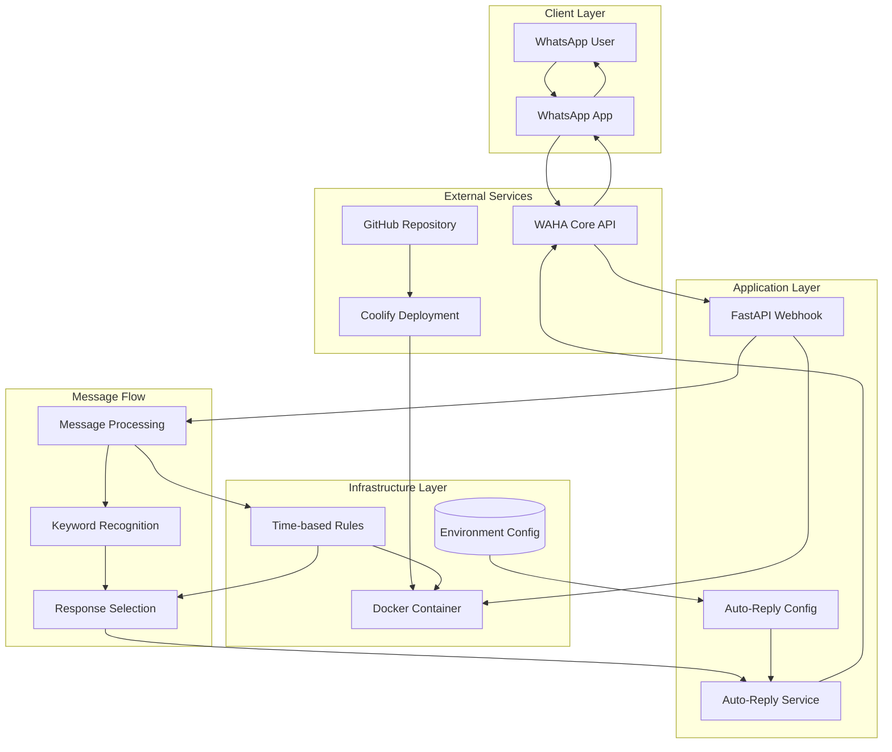
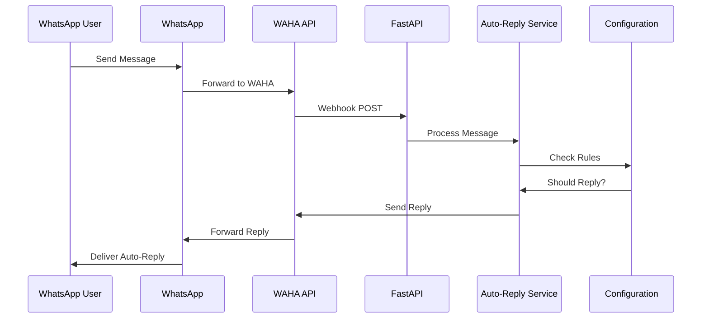
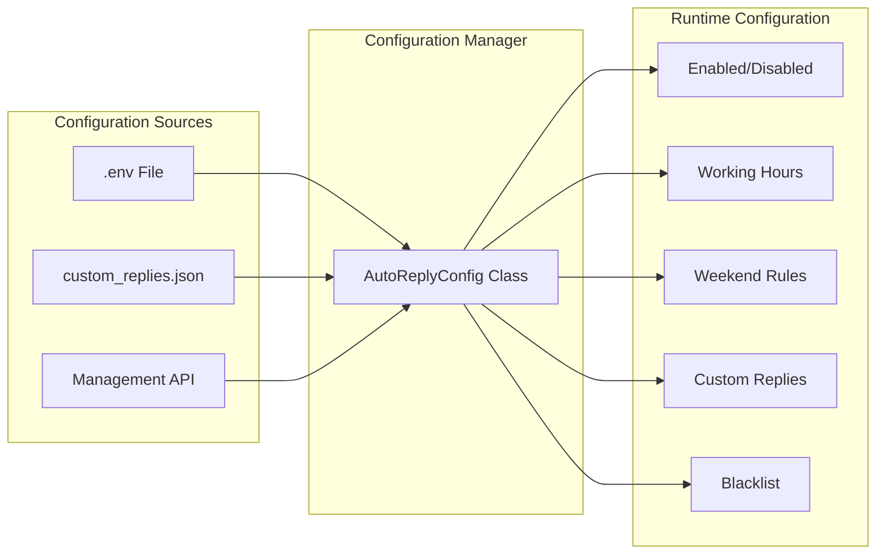
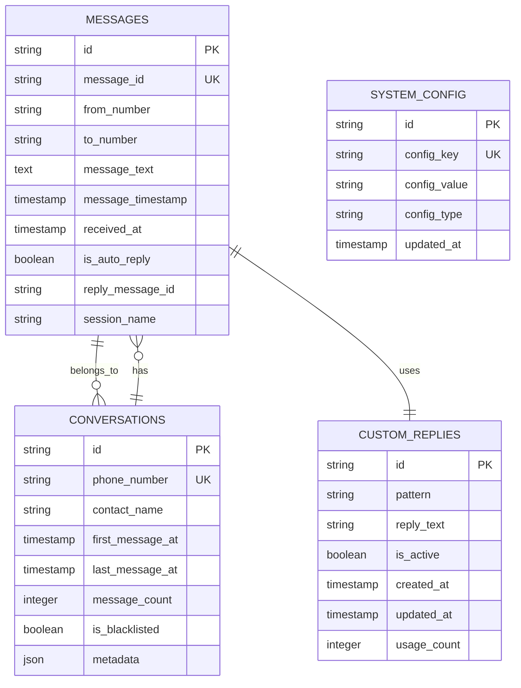
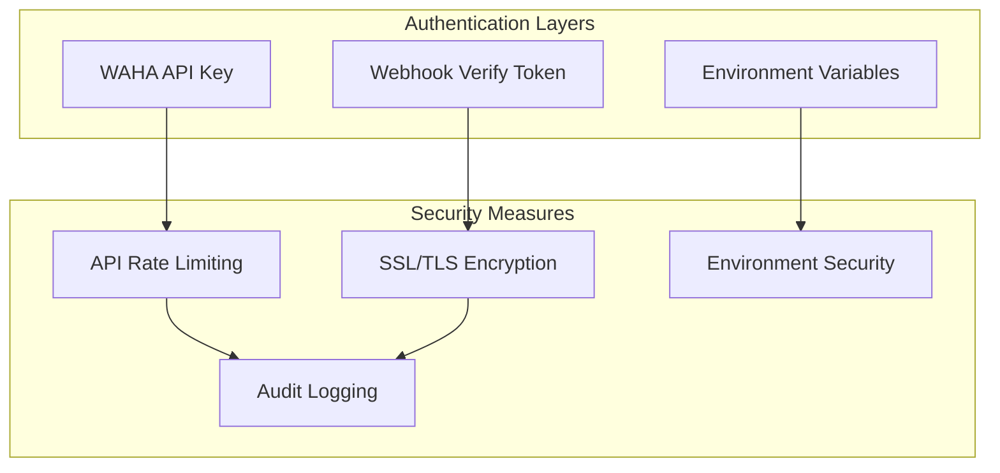

# AI Concierge - Technical Architecture

## System Architecture Overview



## Data Flow Architecture

### 1. Message Reception Flow



### 2. Configuration Management



## Component Architecture

### FastAPI Webhook Component

```python
class WebhookProcessor:
    """
    Main webhook processing component
    """

    def __init__(self):
        self.auto_reply_service = AutoReplyService()
        self.config = auto_reply_config

    async def process_webhook(self, webhook_data: dict) -> bool:
        """
        Process incoming webhook data
        """
        # Validate webhook data
        if not self._validate_webhook(webhook_data):
            return False

        # Extract message information
        message_info = self._extract_message_info(webhook_data)

        # Process auto-reply
        success = await self.auto_reply_service.send_reply(webhook_data)

        return success

    def _validate_webhook(self, data: dict) -> bool:
        """Validate webhook structure"""
        required_fields = ['event', 'session', 'payload']
        return all(field in data for field in required_fields)

    def _extract_message_info(self, data: dict) -> dict:
        """Extract message information"""
        payload = data.get('payload', {})
        return {
            'from': payload.get('from', ''),
            'body': payload.get('body', ''),
            'fromMe': payload.get('fromMe', False),
            'timestamp': payload.get('timestamp', 0)
        }
```

### Auto-Reply Service Component

```python
class AutoReplyService:
    """
    Auto-reply business logic service
    """

    def __init__(self):
        self.api_key = auto_reply_config.waha_api_key
        self.base_url = auto_reply_config.waha_base_url
        self.session_name = auto_reply_config.session_name

    async def send_reply(self, message_data: dict) -> bool:
        """
        Send auto-reply to received message
        """
        try:
            # Check if we should reply
            if not auto_reply_config.should_reply(message_data):
                return False

            # Extract message content
            message_text = self._extract_message_text(message_data)
            from_number = self._extract_phone_number(message_data)

            # Get appropriate reply
            reply_text = auto_reply_config.get_reply_message(message_text)

            # Send the reply
            return await self._send_whatsapp_message(from_number, reply_text)

        except Exception as e:
            logger.error(f"Error in auto-reply service: {e}")
            return False

    def _extract_phone_number(self, message_data: dict) -> str:
        """
        Extract phone number from webhook data
        """
        payload = message_data.get('payload', {})

        # Try remoteJid first (preferred method)
        media = payload.get('media', {})
        if isinstance(media, dict):
            remote_jid = media.get('key', {}).get('remoteJid', '')
            if remote_jid:
                return remote_jid.replace('@c.us', '').replace('@s.whatsapp.net', '')

        # Fallback to from field
        raw_from = payload.get('from', '')
        return raw_from.replace('@c.us', '').replace('@s.whatsapp.net', '')

    async def _send_whatsapp_message(self, to_number: str, message: str) -> bool:
        """
        Send WhatsApp message via WAHA API
        """
        headers = {
            "X-API-Key": self.api_key,
            "Content-Type": "application/json"
        }

        payload = {
            "session": self.session_name,
            "chatId": f"{to_number}@c.us",
            "text": message
        }

        response = requests.post(
            f"{self.base_url}/sendText",
            headers=headers,
            json=payload,
            verify=False
        )

        return response.status_code == 200
```

### Configuration Manager Component

```python
class AutoReplyConfig:
    """
    Configuration management for auto-reply functionality
    """

    def __init__(self):
        self.enabled = self._load_bool_env('AUTO_REPLY_ENABLED', True)
        self.working_hours_start = os.getenv('WORKING_HOURS_START', '09:00')
        self.working_hours_end = os.getenv('WORKING_HOURS_END', '18:00')
        self.weekend_enabled = self._load_bool_env('WEEKEND_AUTO_REPLY', False)
        self.custom_replies = self._load_custom_replies()
        self.blacklisted_contacts = self._load_blacklisted_contacts()

    def should_reply(self, message_data: dict) -> bool:
        """
        Determine if auto-reply should be sent
        """
        # Check if enabled
        if not self.enabled:
            return False

        # Don't reply to own messages
        if message_data.get('fromMe', False):
            return False

        # Check if contact is blacklisted
        from_number = self._extract_phone_number(message_data)
        if self._is_blacklisted(from_number):
            return False

        # Don't reply to group messages
        if self._is_group_message(from_number):
            return self._is_group_reply_enabled()

        return True

    def get_reply_message(self, message_text: str) -> str:
        """
        Get appropriate reply message based on content and time
        """
        # Check for custom keyword matches first
        for pattern, reply in self.custom_replies.items():
            if re.search(pattern, message_text, re.IGNORECASE):
                return reply

        # Time-based replies
        if self.is_working_hours():
            return os.getenv('DEFAULT_REPLY', self.default_reply)
        else:
            return os.getenv('OUT_OF_HOURS_REPLY', self.out_of_hours_reply)

    def is_working_hours(self) -> bool:
        """
        Check if current time is within working hours
        """
        now = datetime.now()

        # Check if weekend
        if now.weekday() >= 5 and not self.weekend_enabled:
            return False

        # Parse working hours
        start_time = datetime.strptime(self.working_hours_start, '%H:%M').time()
        end_time = datetime.strptime(self.working_hours_end, '%H:%M').time()
        current_time = now.time()

        return start_time <= current_time <= end_time
```

## Database Schema (Future Enhancement)



## API Endpoints Documentation

### Webhook Endpoints

#### POST /webhook
**Description**: Main webhook endpoint for receiving WAHA events

**Request Body**:
```json
{
  "id": "evt_01k52as4sv2vssjncnz17x77ta",
  "timestamp": 1757793784637,
  "event": "message",
  "session": "default",
  "payload": {
    "from": "221765005555@c.us",
    "fromMe": false,
    "body": "bonjour",
    "hasMedia": false
  }
}
```

**Response**: `200 OK`

#### GET /webhook
**Description**: Webhook verification endpoint

**Query Parameters**:
- `hub.mode`: "subscribe"
- `hub.challenge`: verification token
- `hub.verify_token`: configured verify token

**Response**: `200 OK` with challenge token

### Management Endpoints

#### GET /auto-reply/status
**Description**: Get current auto-reply configuration status

**Response**:
```json
{
  "enabled": true,
  "working_hours_start": "09:00",
  "working_hours_end": "18:00",
  "weekend_enabled": false,
  "is_working_hours": false,
  "custom_replies_count": 7,
  "blacklisted_contacts": [""]
}
```

#### POST /auto-reply/toggle
**Description**: Enable or disable auto-reply functionality

**Request Body**:
```json
{
  "enabled": true
}
```

**Response**:
```json
{
  "enabled": true,
  "message": "Auto-reply enabled"
}
```

#### POST /auto-reply/test
**Description**: Send test auto-reply message

**Response**:
```json
{
  "success": true,
  "message": "Test message sent"
}
```

#### POST /auto-reply/custom-replies
**Description**: Update custom reply patterns

**Request Body**:
```json
{
  "bonjour|hello": "👋 Bonjour! Comment puis-je vous aider?",
  "merci|thanks": "🙏 Avec plaisir!"
}
```

**Response**:
```json
{
  "message": "Custom replies updated successfully",
  "count": 2
}
```

## Security Architecture

### Authentication Flow



### Security Considerations

1. **API Key Management**
   - Stored in environment variables
   - Never exposed in logs or client-side code
   - Regular rotation recommended

2. **Webhook Security**
   - Verify token for endpoint validation
   - HTTPS-only communication
   - IP whitelisting (optional)

3. **Data Protection**
   - No sensitive data logging
   - Secure communication channels
   - Regular security audits

## Deployment Architecture

### Coolify Deployment Configuration

```yaml
version: '3.8'
services:
  ai-concierge:
    build: .
    expose:
      - "8000"
    environment:
      - NODE_ENV=production
    healthcheck:
      test: ["CMD", "curl", "-f", "http://localhost:8000/"]
      interval: 30s
      timeout: 10s
      retries: 3
```

### Infrastructure Requirements

- **Docker**: Container runtime
- **Coolify**: Deployment platform
- **Domain**: SSL-enabled domain
- **WAHA API**: WhatsApp integration
- **GitHub**: Source code management

### Monitoring and Health Checks

```python
@app.get("/")
async def health_check():
    """Basic health check endpoint"""
    return {
        "status": "running",
        "service": "WhatsApp Webhook",
        "timestamp": datetime.now().isoformat()
    }

@app.get("/auto-reply/status")
async def auto_reply_status():
    """Auto-reply configuration status"""
    return {
        "enabled": auto_reply_config.enabled,
        "working_hours_start": auto_reply_config.working_hours_start,
        "working_hours_end": auto_reply_config.working_hours_end,
        "weekend_enabled": auto_reply_config.weekend_enabled,
        "is_working_hours": auto_reply_config.is_working_hours(),
        "custom_replies_count": len(auto_reply_config.custom_replies),
        "blacklisted_contacts": list(auto_reply_config.blacklisted_contacts)
    }
```

---

This architecture document provides a comprehensive technical overview of the AI Concierge system, including component interactions, data flows, security considerations, and deployment strategies.