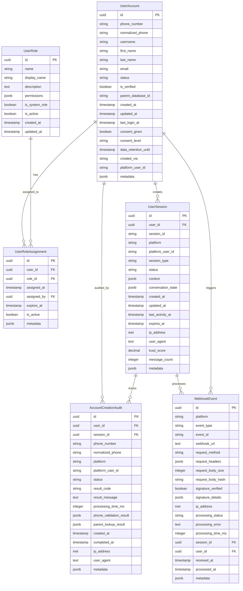

# Data Model: Automatic Account Creation System

**Feature**: Automatic Account Creation Based on Phone Number
**Date**: 2025-01-25
**Storage**: Supabase (PostgreSQL) with Redis caching

## Entity Overview

This data model defines the entities required for automatic account creation, session management, and audit logging. The model supports multi-platform interactions (WhatsApp/Telegram) with GDPR compliance and role-based access control, aligned with the research decisions.

## Core Entities

### 1. UserAccount

Represents a system user account linked to catechism parent database.

```sql
CREATE TABLE user_accounts (
    id UUID PRIMARY KEY DEFAULT gen_random_uuid(),
    phone_number VARCHAR(20) NOT NULL UNIQUE,
    normalized_phone VARCHAR(20) NOT NULL UNIQUE,
    username VARCHAR(100),
    first_name VARCHAR(100),
    last_name VARCHAR(100),
    email VARCHAR(255),
    status VARCHAR(20) NOT NULL DEFAULT 'active',
    is_verified BOOLEAN NOT NULL DEFAULT false,
    parent_database_id VARCHAR(100), -- Reference to catechism database
    created_at TIMESTAMP WITH TIME ZONE DEFAULT NOW(),
    updated_at TIMESTAMP WITH TIME ZONE DEFAULT NOW(),
    last_login_at TIMESTAMP WITH TIME ZONE,

    -- GDPR fields
    consent_given BOOLEAN NOT NULL DEFAULT false,
    consent_level VARCHAR(20) NOT NULL DEFAULT 'minimal',
    data_retention_until TIMESTAMP WITH TIME ZONE,

    -- Metadata
    created_via VARCHAR(20) NOT NULL, -- 'whatsapp', 'telegram', 'manual'
    platform_user_id VARCHAR(100), -- Platform-specific user ID
    metadata JSONB DEFAULT '{}'::jsonb,

    CONSTRAINT valid_status CHECK (status IN ('active', 'inactive', 'suspended', 'deleted')),
    CONSTRAINT valid_consent_level CHECK (consent_level IN ('minimal', 'standard', 'full')),
    CONSTRAINT valid_created_via CHECK (created_via IN ('whatsapp', 'telegram', 'manual'))
);

-- Indexes for performance
CREATE INDEX idx_user_accounts_phone ON user_accounts(phone_number);
CREATE INDEX idx_user_accounts_normalized_phone ON user_accounts(normalized_phone);
CREATE INDEX idx_user_accounts_status ON user_accounts(status);
CREATE INDEX idx_user_accounts_created_at ON user_accounts(created_at);
CREATE INDEX idx_user_accounts_platform ON user_accounts(created_via, platform_user_id);
```

**Fields Description**:
- `phone_number`: Original phone number from user input
- `normalized_phone`: E.164 formatted phone number for consistent storage
- `parent_database_id`: Reference ID to external catechism database
- `consent_level`: GDPR consent level (minimal/standard/full)
- `created_via`: Platform through which account was created
- `platform_user_id`: Platform-specific user identifier

### 2. UserRole

Defines system roles that can be assigned to users.

```sql
CREATE TABLE user_roles (
    id UUID PRIMARY KEY DEFAULT gen_random_uuid(),
    name VARCHAR(50) NOT NULL UNIQUE,
    display_name VARCHAR(100) NOT NULL,
    description TEXT,
    permissions JSONB NOT NULL DEFAULT '[]'::jsonb,
    is_system_role BOOLEAN NOT NULL DEFAULT false,
    is_active BOOLEAN NOT NULL DEFAULT true,
    created_at TIMESTAMP WITH TIME ZONE DEFAULT NOW(),
    updated_at TIMESTAMP WITH TIME ZONE DEFAULT NOW(),

    CONSTRAINT valid_name CHECK (name ~ '^[a-z_][a-z0-9_]*$')
);

-- Insert default roles
INSERT INTO user_roles (name, display_name, description, permissions, is_system_role) VALUES
('parent', 'Parent', 'Parent with access to catechism information', '["view_children", "view_schedule", "send_messages"]', true),
('super_admin', 'Super Administrator', 'Full system administration access', '["*"]', true),
('catechist', 'Catechist', 'Catechism teacher role', '["view_students", "manage_classes", "view_schedule"]', true),
('staff', 'Staff Member', 'General staff access', '["view_basic_info", "send_messages"]', true);
```

**Fields Description**:
- `name`: System-readable role name (lowercase, underscore-separated)
- `display_name`: Human-readable role name
- `permissions`: JSON array of permission strings
- `is_system_role`: Whether this is a predefined system role

### 3. UserRoleAssignment

Links users to roles with assignment metadata.

```sql
CREATE TABLE user_role_assignments (
    id UUID PRIMARY KEY DEFAULT gen_random_uuid(),
    user_id UUID NOT NULL REFERENCES user_accounts(id) ON DELETE CASCADE,
    role_id UUID NOT NULL REFERENCES user_roles(id) ON DELETE CASCADE,
    assigned_at TIMESTAMP WITH TIME ZONE DEFAULT NOW(),
    assigned_by UUID REFERENCES user_accounts(id),
    expires_at TIMESTAMP WITH TIME ZONE,
    is_active BOOLEAN NOT NULL DEFAULT true,
    metadata JSONB DEFAULT '{}'::jsonb,

    UNIQUE(user_id, role_id),
    CONSTRAINT valid_assignment CHECK (expires_at IS NULL OR expires_at > assigned_at)
);

-- Indexes
CREATE INDEX idx_user_role_assignments_user_id ON user_role_assignments(user_id);
CREATE INDEX idx_user_role_assignments_role_id ON user_role_assignments(role_id);
CREATE INDEX idx_user_role_assignments_active ON user_role_assignments(is_active, expires_at);
```

**Fields Description**:
- `assigned_by`: User who made this role assignment (null for system assignments)
- `expires_at`: Optional expiration time for temporary role assignments
- `metadata`: Additional assignment information (reason, source, etc.)

### 4. UserSession

Manages user sessions across different platforms with dual persistence.

```sql
CREATE TABLE user_sessions (
    id UUID PRIMARY KEY DEFAULT gen_random_uuid(),
    user_id UUID REFERENCES user_accounts(id) ON DELETE CASCADE,
    session_id VARCHAR(255) NOT NULL UNIQUE,
    platform VARCHAR(20) NOT NULL,
    platform_user_id VARCHAR(100) NOT NULL,
    session_type VARCHAR(20) NOT NULL DEFAULT 'account_creation',
    status VARCHAR(20) NOT NULL DEFAULT 'active',

    -- Session data
    context JSONB NOT NULL DEFAULT '{}'::jsonb,
    conversation_state JSONB NOT NULL DEFAULT '{}'::jsonb,

    -- Timestamps
    created_at TIMESTAMP WITH TIME ZONE DEFAULT NOW(),
    updated_at TIMESTAMP WITH TIME ZONE DEFAULT NOW(),
    last_activity_at TIMESTAMP WITH TIME ZONE DEFAULT NOW(),
    expires_at TIMESTAMP WITH TIME ZONE,

    -- Security
    ip_address INET,
    user_agent TEXT,
    trust_score DECIMAL(3,2) DEFAULT 0.80,

    -- Metadata
    message_count INTEGER NOT NULL DEFAULT 0,
    metadata JSONB DEFAULT '{}'::jsonb,

    CONSTRAINT valid_platform CHECK (platform IN ('whatsapp', 'telegram')),
    CONSTRAINT valid_session_type CHECK (session_type IN ('account_creation', 'general', 'admin')),
    CONSTRAINT valid_status CHECK (status IN ('active', 'inactive', 'expired', 'terminated')),
    CONSTRAINT valid_trust_score CHECK (trust_score >= 0.0 AND trust_score <= 1.0),
    CONSTRAINT valid_expires_at CHECK (expires_at IS NULL OR expires_at > created_at)
);

-- Indexes
CREATE INDEX idx_user_sessions_user_id ON user_sessions(user_id);
CREATE INDEX idx_user_sessions_session_id ON user_sessions(session_id);
CREATE INDEX idx_user_sessions_platform ON user_sessions(platform, platform_user_id);
CREATE INDEX idx_user_sessions_status ON user_sessions(status);
CREATE INDEX idx_user_sessions_last_activity ON user_sessions(last_activity_at);
CREATE INDEX idx_user_sessions_expires_at ON user_sessions(expires_at);
```

**Fields Description**:
- `session_id`: Unique session identifier (used in Redis cache)
- `platform`: Messaging platform (whatsapp/telegram)
- `context`: Session context data (language, preferences, etc.)
- `conversation_state`: Current conversation state and history
- `trust_score`: Security trust score for this session

### 5. AccountCreationAudit

Audit trail for all account creation activities with comprehensive tracking.

```sql
CREATE TABLE account_creation_audit (
    id UUID PRIMARY KEY DEFAULT gen_random_uuid(),
    user_id UUID REFERENCES user_accounts(id) ON DELETE SET NULL,
    session_id UUID REFERENCES user_sessions(id) ON DELETE SET NULL,

    -- Request details
    phone_number VARCHAR(20) NOT NULL,
    normalized_phone VARCHAR(20) NOT NULL,
    platform VARCHAR(20) NOT NULL,
    platform_user_id VARCHAR(100) NOT NULL,

    -- Processing details
    status VARCHAR(20) NOT NULL,
    result_code VARCHAR(50),
    result_message TEXT,
    processing_time_ms INTEGER,

    -- Data validation
    phone_validation_result JSONB,
    parent_lookup_result JSONB,

    -- Timestamps
    created_at TIMESTAMP WITH TIME ZONE DEFAULT NOW(),
    completed_at TIMESTAMP WITH TIME ZONE,

    -- Security
    ip_address INET,
    user_agent TEXT,

    -- Metadata
    metadata JSONB DEFAULT '{}'::jsonb,

    CONSTRAINT valid_platform CHECK (platform IN ('whatsapp', 'telegram')),
    CONSTRAINT valid_status CHECK (status IN ('initiated', 'phone_validated', 'parent_found', 'account_created', 'failed', 'duplicate')),
    CONSTRAINT valid_processing_time CHECK (processing_time_ms >= 0),
    CONSTRAINT valid_completion CHECK (completed_at IS NULL OR completed_at >= created_at)
);

-- Indexes
CREATE INDEX idx_account_creation_audit_user_id ON account_creation_audit(user_id);
CREATE INDEX idx_account_creation_audit_phone ON account_creation_audit(normalized_phone);
CREATE INDEX idx_account_creation_audit_platform ON account_creation_audit(platform, created_at);
CREATE INDEX idx_account_creation_audit_status ON account_creation_audit(status);
CREATE INDEX idx_account_creation_audit_created_at ON account_creation_audit(created_at);
```

**Fields Description**:
- `status`: Current status of account creation process
- `processing_time_ms`: Time taken to process the request
- `phone_validation_result`: Detailed phone number validation result
- `parent_lookup_result`: Result of parent database lookup
- `metadata`: Additional audit information (error details, retry attempts, etc.)

### 6. WebhookEvent

Log of incoming webhook events for security and debugging.

```sql
CREATE TABLE webhook_events (
    id UUID PRIMARY KEY DEFAULT gen_random_uuid(),
    platform VARCHAR(20) NOT NULL,
    event_type VARCHAR(50) NOT NULL,
    event_id VARCHAR(255), -- Platform-specific event ID

    -- Request details
    webhook_url TEXT NOT NULL,
    request_method VARCHAR(10) NOT NULL,
    request_headers JSONB NOT NULL DEFAULT '{}'::jsonb,
    request_body_size INTEGER,
    request_body_hash VARCHAR(64), -- SHA-256 hash for integrity

    -- Security (from research: signature verification)
    signature_verified BOOLEAN NOT NULL DEFAULT false,
    signature_details JSONB,
    ip_address INET,

    -- Processing
    processing_status VARCHAR(20) NOT NULL DEFAULT 'pending',
    processing_error TEXT,
    processing_time_ms INTEGER,

    -- Relations
    session_id UUID REFERENCES user_sessions(id) ON DELETE SET NULL,
    user_id UUID REFERENCES user_accounts(id) ON DELETE SET NULL,

    -- Timestamps
    received_at TIMESTAMP WITH TIME ZONE DEFAULT NOW(),
    processed_at TIMESTAMP WITH TIME ZONE,

    -- Metadata
    metadata JSONB DEFAULT '{}'::jsonb,

    CONSTRAINT valid_platform CHECK (platform IN ('whatsapp', 'telegram')),
    CONSTRAINT valid_status CHECK (processing_status IN ('pending', 'processing', 'completed', 'failed', 'ignored')),
    CONSTRAINT valid_processing_time CHECK (processing_time_ms >= 0)
);

-- Indexes
CREATE INDEX idx_webhook_events_platform ON webhook_events(platform, received_at);
CREATE INDEX idx_webhook_events_status ON webhook_events(processing_status);
CREATE INDEX idx_webhook_events_signature ON webhook_events(signature_verified, received_at);
CREATE INDEX idx_webhook_events_session_id ON webhook_events(session_id);
```

**Fields Description**:
- `event_id`: Platform-specific event identifier for deduplication
- `signature_verified`: Whether webhook signature was successfully verified
- `signature_details`: Details about signature verification process
- `request_body_hash`: Hash of request body for integrity verification

## Entity Relationships



## Redis Cache Schema

### Session Cache Structure
```redis
# Session cache keys
session:{session_id} -> {
    "user_id": "uuid",
    "platform": "whatsapp|telegram",
    "context": {...},
    "conversation_state": {...},
    "last_activity": "timestamp",
    "expires_at": "timestamp"
}
TTL: 1800 seconds (30 minutes)

# User lookup cache
user_lookup:{normalized_phone} -> {
    "user_id": "uuid",
    "status": "active|inactive",
    "roles": ["parent", "admin"]
}
TTL: 3600 seconds (1 hour)

# Phone validation cache
phone_validation:{phone_hash} -> {
    "is_valid": true,
    "normalized_phone": "+221765005555",
    "country_code": "SN",
    "carrier": "Orange"
}
TTL: 86400 seconds (24 hours)

# Rate limiting
rate_limit:{identifier} -> {
    "count": 5,
    "window_start": "timestamp"
}
TTL: 300 seconds (5 minutes)
```

## Validation Rules

### Phone Number Validation (from research)
```python
# Senegal-specific phone validation rules
SENEGAL_PHONE_RULES = {
    "country_code": 221,
    "mobile_prefixes": ["70", "71", "72", "73", "76", "77", "78", "79"],
    "national_length": 9,
    "format_patterns": [
        r"^\+221[7][0-9]\d{7}$",     # +2217XXXXXXX
        r"^00221[7][0-9]\d{7}$",     # 002217XXXXXXX
        r"^[7][0-9]\d{7}$"           # 7XXXXXXX (local)
    ],
    "carriers": {
        "70": "Expresso", "71": "Expresso",
        "72": "Orange", "73": "Orange", "76": "Orange", "77": "Orange",
        "78": "Free", "79": "Free"
    }
}
```

### User Account Validation
```python
# User account constraints
USER_ACCOUNT_CONSTRAINTS = {
    "phone_number": {
        "required": True,
        "unique": True,
        "format": "E.164"
    },
    "username": {
        "required": False,
        "unique": True,
        "pattern": r"^[a-zA-Z0-9_-]{3,30}$"
    },
    "email": {
        "required": False,
        "format": "email",
        "unique": True
    },
    "status": {
        "required": True,
        "values": ["active", "inactive", "suspended", "deleted"]
    },
    "consent_level": {
        "required": True,
        "values": ["minimal", "standard", "full"]
    }
}
```

### Session Validation
```python
# Session constraints
SESSION_CONSTRAINTS = {
    "session_id": {
        "required": True,
        "unique": True,
        "pattern": r"^[a-zA-Z0-9_-]{20,}$"
    },
    "platform": {
        "required": True,
        "values": ["whatsapp", "telegram"]
    },
    "trust_score": {
        "min": 0.0,
        "max": 1.0,
        "default": 0.80
    },
    "session_type": {
        "values": ["account_creation", "general", "admin"]
    }
}
```

## Data Privacy and GDPR (from research)

### Personal Data Classification
- **High Sensitivity**: Phone numbers, email addresses, names
- **Medium Sensitivity**: Session data, IP addresses, user agents
- **Low Sensitivity**: User IDs, role assignments, audit metadata

### Data Minimization Rules
```python
# Data minimization from research
PRIVACY_RULES = {
    "phone_number_masking": "+221*******",  # Mask in logs
    "email_masking": "****@domain.com",    # Mask in logs
    "ip_retention_days": 30,               # IP address retention
    "session_data_retention_days": 90,     # Session data retention
    "audit_log_retention_years": 6,        # Audit log retention
    "auto_anonymization_after_days": 365   # Full anonymization
}
```

### Consent Management (from research)
```python
# Consent levels from research
CONSENT_LEVELS = {
    "minimal": {
        "description": "Account creation and basic functionality",
        "data_access": ["phone_number", "name"],
        "retention_days": 30
    },
    "standard": {
        "description": "Full platform functionality",
        "data_access": ["phone_number", "name", "email", "session_data"],
        "retention_days": 365
    },
    "full": {
        "description": "Analytics and personalization",
        "data_access": ["all_data"],
        "retention_days": 1825  # 5 years
    }
}
```

## Performance Optimization (from research)

### Indexing Strategy
1. **Primary Keys**: UUID with B-tree index
2. **Foreign Keys**: Indexed for join performance
3. **Unique Constraints**: Phone numbers, usernames, emails
4. **Query Patterns**: Status, timestamps, platform lookups
5. **Composite Indexes**: Platform + user_id for session lookups

### Caching Strategy (from research)
- **Redis L1**: Active sessions (30-minute TTL)
- **Redis L2**: User account lookups (1-hour TTL)
- **Redis L3**: Phone validation results (24-hour TTL)
- **Intelligent Caching**: Access pattern-based cache tier allocation

## Migration Strategy

### Initial Migration
```sql
-- Migration 001: Create account tables for Supabase
-- This migration creates all tables for the automatic account creation feature
-- Database: Supabase PostgreSQL
-- Dependencies: None
-- Estimated time: 5 minutes
-- Rollback: Supported (tables will be dropped)

-- Enable required extensions
CREATE EXTENSION IF NOT EXISTS "uuid-ossp";
CREATE EXTENSION IF NOT EXISTS "pgcrypto";

-- Create tables in order of dependencies
-- (table definitions as above)

-- Insert default system roles
INSERT INTO user_roles (name, display_name, description, permissions, is_system_role) VALUES
('parent', 'Parent', 'Parent with access to catechism information', '["view_children", "view_schedule", "send_messages"]', true),
('super_admin', 'Super Administrator', 'Full system administration access', '["*"]', true),
('catechist', 'Catechist', 'Catechism teacher role', '["view_students", "manage_classes", "view_schedule"]', true),
('staff', 'Staff Member', 'General staff access', '["view_basic_info", "send_messages"]', true);

-- Create Row Level Security policies
ALTER TABLE user_accounts ENABLE ROW LEVEL SECURITY;
ALTER TABLE user_sessions ENABLE ROW LEVEL SECURITY;
ALTER TABLE account_creation_audit ENABLE ROW LEVEL SECURITY;

-- Basic RLS policies (will be enhanced during implementation)
CREATE POLICY "Users can view own accounts" ON user_accounts
    FOR SELECT USING (auth.uid()::text = id::text);

CREATE POLICY "Users can view own sessions" ON user_sessions
    FOR SELECT USING (auth.uid()::text = user_id::text);
```

### Data Migration
- **Initial Data**: Load existing roles and super admin accounts
- **Parent Database**: Set up external database connection to catechism system
- **Session Migration**: Migrate any existing session data to new structure
- **Audit Trail**: Initialize audit logging with system creation events

### Backward Compatibility
- **API Changes**: Versioned endpoints (v1/)
- **Database Changes**: Additive changes only through Supabase migrations
- **Configuration**: Backward-compatible config options
- **Authentication**: Support legacy auth methods during transition

## Security Considerations

### Database Security (Supabase)
- **Row Level Security**: Enable RLS on all user tables
- **Authentication**: Use Supabase Auth with custom claims
- **API Keys**: Secure API key management with proper roles
- **Connection Security**: Enforce SSL/TLS connections

### Data Integrity
- **Constraints**: Enforce data integrity at database level
- **Validations**: Server-side validation with database constraints
- **Transactions**: Ensure atomic operations for account creation
- **Rollback**: Support transaction rollback on errors

### Privacy Protection (GDPR from research)
- **Anonymization**: Automatic data anonymization after retention period
- **Pseudonymization**: Use hashes instead of direct identifiers where possible
- **Access Logs**: Comprehensive audit trail for data access
- **Right to Deletion**: Support GDPR right to be forgotten

## Integration Points

### External Catechism Database
```python
# Parent database integration pattern
async def lookup_parent_by_phone(normalized_phone: str) -> Optional[ParentRecord]:
    """
    Lookup parent in external catechism database
    """
    # Implementation will connect to existing catechese database
    # Use phone number normalization and matching logic
    pass
```

### WhatsApp Integration (from research)
```python
# WhatsApp webhook security integration
async def verify_webhook_signature(
    request: Request,
    body: bytes
) -> bool:
    """
    Verify WhatsApp Cloud API webhook signature
    """
    signature_header = request.headers.get("X-Hub-Signature-256")
    # Implementation from research findings
    pass
```

### Multi-Platform Session Management (from research)
```python
# Cross-platform session linking
async def link_platform_sessions(
    unified_user_id: str,
    platform: str,
    session_data: Dict
) -> bool:
    """
    Link sessions across platforms for unified user experience
    """
    # Implementation from research findings
    pass
```

---
**Model Completed**: 2025-01-25T16:15:00Z
**Version**: 2.0 (Updated for Supabase + Redis architecture)
**Storage**: Supabase PostgreSQL with Redis caching
**Compliance**: GDPR-ready with privacy-by-design